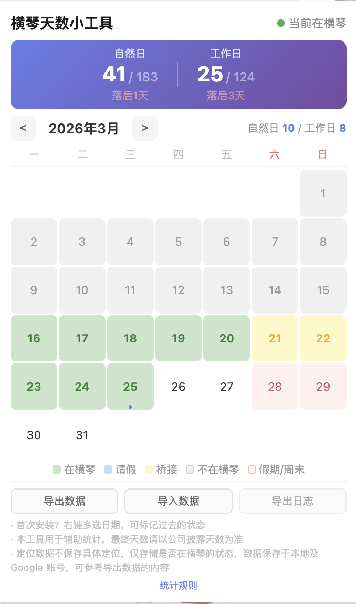

# 横琴天数小工具

一款 Chrome 浏览器扩展，帮助你统计在珠海横琴粤澳深度合作区的年度驻留天数。

## 功能

- **自动定位打卡** — 基于 GPS 自动判断是否在横琴（8km 范围），每 30 分钟后台检测一次
- **年度进度追踪** — 实时统计自然日（目标 183 天）和工作日（目标 124 天），显示进度偏差
- **日历视图** — 按月查看每日状态，颜色区分在横琴 / 请假 / 桥接 / 不在横琴
- **假期桥接** — 法定假期前后都在横琴，假期自动计入（如国庆前后在横琴，10/1-10/7 全部桥接）
- **手动标记** — 右键日期可手动标记"在横琴"或"请假"，支持多选批量操作
- **数据导入导出** — 支持 JSON 格式导入导出，数据通过 Google 账号跨设备同步

## 截图

<p align="center">
  
</p>

## 安装

从 Chrome Web Store 安装：

**[横琴天数小工具](https://chromewebstore.google.com/detail/lbbjahidndncgkgaljeebohdmajdnefe)**

---

## macOS 菜单栏插件

仓库内 `Sources/HengqinTracker/` 是同名功能的 macOS 菜单栏原生应用，纯 SwiftUI / AppKit。

### 本地开发

```bash
swift build       # 编译
swift run HengqinTracker
swift test        # 单元测试
```

启动后菜单栏右侧会出现 `横 NNN`，点击展开年/月热力图面板。

### 数据导入 / 导出

面板底部「设置」 → 「数据」区域，可导入或导出与 Chrome 扩展兼容的 JSON 备份格式：

```json
{
  "version": 1,
  "exportDate": "2026-05-19T17:12:09.360Z",
  "data": {
    "day_2026-01-01": { "inHengqin": true, "isLeave": false, "manualHengqin": true }
  }
}
```

**导入会完全覆盖**当前本地数据（弹出二次确认）。

### 签名打包 / iCloud 跨设备同步

仓库内 `script/build_signed_app.sh` 一键产出 Developer ID 签名后的 `.app`，并在条件满足时自动启用 iCloud KVS 跨设备同步。

```bash
./script/build_signed_app.sh                 # 只 build + 签名
./script/build_signed_app.sh install         # 同时拷到 ~/Applications/
./script/build_signed_app.sh install run     # …并立即启动
```

#### 两种模式

| 模式 | 触发条件 | 启用功能 |
|---|---|---|
| **LITE** | `script/embedded.provisionprofile` 不存在 | 仅本地数据 + 导入/导出。iCloud 同步显示「不可用」 |
| **FULL** | `script/embedded.provisionprofile` 存在 | 完整启用，包含 iCloud KVS 跨设备同步 |

脚本会自动探测 provisioning profile 是否存在并选择对应的 entitlements。**LITE 模式现在就能跑**，FULL 模式需要先完成下面这一次性的 Apple Developer 后台配置。

#### 启用 iCloud 同步（一次性配置）

整套机制是：限制性 entitlement（`com.apple.developer.ubiquity-kvstore-identifier`）必须由一份嵌入的 provisioning profile 授权，否则 launchd 拒绝启动（错误 153，`taskgated: "no eligible provisioning profiles found"`）。

操作步骤：

1. **登录** [developer.apple.com](https://developer.apple.com/account) → Certificates, Identifiers & Profiles
2. **注册 App ID** → Identifiers → `+` → App IDs → App
   - Bundle ID（Explicit）：`com.harry.dayshere`
   - Capabilities：勾选 **iCloud**（选 "Include CloudKit support" 即可，KVS 不单独显示开关）
3. **创建 Profile** → Profiles → `+` → Distribution → **Developer ID** → 下一步选刚才注册的 App ID → 选 Developer ID Application 证书 → 取个名字（如 `HengqinTracker DevID`） → Generate → Download
4. 把下载到的 `.provisionprofile` 文件**重命名**为 `embedded.provisionprofile` 并放到仓库 `script/` 目录下
5. 重新执行 `./script/build_signed_app.sh install run`

控制台 / 设置页应能看到「已同步」状态。两台 Mac 同登 Apple ID + 同样的 `.app`，记录会自动双向合并（系统 last-write-wins）。

#### Notarization（仅当要分发到其他人电脑时）

只在自己几台 Mac 间使用，可以**跳过** notarization（Gatekeeper 不会阻止你自己签的本地拷贝）。
如果要给别人，需要：

```bash
xcrun notarytool submit dist/HengqinTracker.app.zip \
    --apple-id <你的 Apple ID> --team-id HYF3XBWBL2 --password <App-specific password> \
    --wait
xcrun stapler staple dist/HengqinTracker.app
```

裸 `swift run` 没签名也没 entitlement，设置页会显示「不可用 · 未登录 iCloud，或当前为未签名构建」，本地导入/导出依旧可用。

